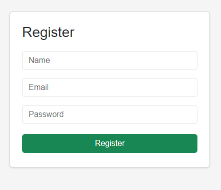
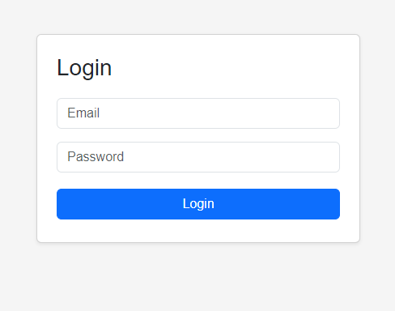
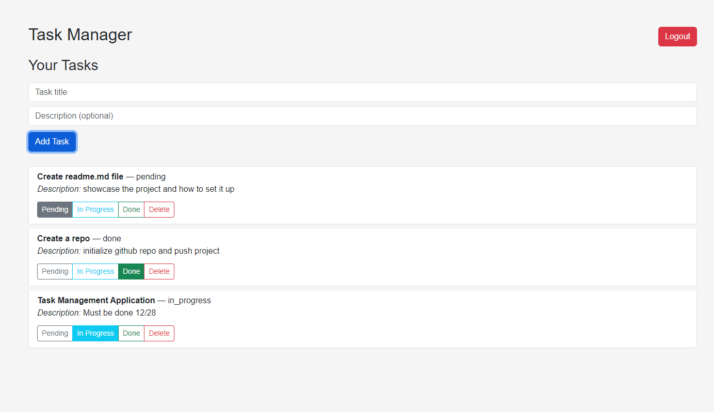

# Task Manager App

A simple full-stack task management application with authentication, built as a junior full-stack assessment project.

---

## 🖥️ Tech Stack

**Backend:** Node.js + Express + SQLite  
**Frontend:** React (Vite)  
**Authentication:** JWT + bcrypt  

---

## ⚙️ Setup Instructions

### Backend
1. Go to the backend folder:
```bash
cd backend
```
2. Install dependencies:
```bash
npm install
```
3. Create a `.env` file in `backend/`:
```
JWT_SECRET=your_secret_key
```
4. Start backend server:
```bash
npm run dev
```
The server runs at `http://localhost:5000`.

### Frontend
1. Go to the frontend folder:
```bash
cd frontend
```
2. Install dependencies:
```bash
npm install
```
3. Start frontend server:
```bash
npm run dev
```
The frontend runs at `http://localhost:5173`.

---

## 🔗 API Endpoints

### Auth
- `POST /api/auth/register` — Register a new user  
  **Body:** `{ "name": "string", "email": "string", "password": "string" }`
- `POST /api/auth/login` — Login user, returns JWT  
  **Body:** `{ "email": "string", "password": "string" }`  
  **Response:** `{ "token": "jwt_token", "user": { id, name, email } }`

### Tasks (JWT required in `Authorization: Bearer <token>` header)
- `GET /api/tasks` — Get all tasks of logged-in user
- `POST /api/tasks` — Create a task  
  **Body:** `{ "title": "string", "description": "string (optional)" }`
- `PUT /api/tasks/:id` — Update task  
  **Body:** `{ "title"?, "description"?, "status"? }`
- `DELETE /api/tasks/:id` — Delete task

---

## 📌 Notes / Assumptions
- Only authenticated users can access tasks.
- Passwords are hashed with bcrypt before storing.
- JWT expires in 1 day.
- Tasks are filtered by the logged-in user (ownership enforced on backend).
- Frontend stores JWT in localStorage.
- Simple UI; responsiveness is basic.

---

## 📂 Frontend Structure

```
frontend/
├── src/
│   ├── api/          # Axios API client
│   ├── components/   # Reusable UI components
│   ├── pages/        # Pages: Login, Register, Tasks
│   ├── App.jsx
│   ├── main.jsx
│   └── index.css
```

---

## 🗂️ Backend Structure

```
backend/
├── src/
│   ├── routes/
│   │   ├── auth.js      # Register & Login endpoints
│   │   └── tasks.js     # Task CRUD endpoints
│   ├── middleware/
│   │   └── authMiddleware.js  # JWT validation
│   ├── db.js            # SQLite connection
│   └── server.js        # Express server
├── package.json
├── .env                 # JWT secret
└── database.sqlite      # SQLite database file (auto-created)
```

---

## 📸 Screenshots

**Register Page**  


**Login Page**  


**Tasks Page**  



